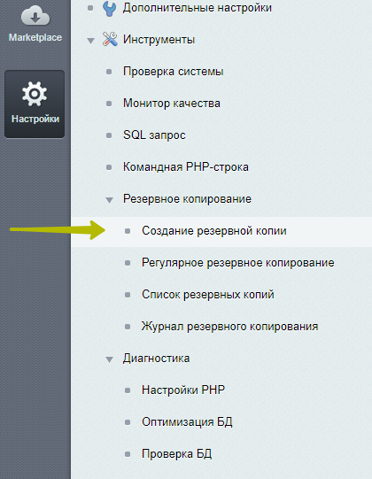

# Описание
Тестовое задание для первого погружения в разработку на битрикс. При разработке использовать стандартные компоненты битрикс.

Необходимые файлы лежат в ./dist
Дедлайн - 3 календарных дня (на четвертый после получения задания необходимо отправить).
Если часть задания не выполнена - написать какие пункты остались и сколько времени (в часах) необходимо на полную готовность.

Страницы фронта на pages закреплены справа от репозитория.

# Задание 

1. Установить Битрикс на виртуальный хостинг/локальную машину (редакция - Стандарт).
2. Натянуть верстку из репозитория.
3. Сделать бэкап и отправить конечный результат

# ТЗ по разделам и страницам
#### Общая структура и описание
На выходе должна получиться физическая структура:

> Главная страница
>> &nbsp;&nbsp;&nbsp;&nbsp;Раздел с исполнителями
>>> &nbsp;&nbsp;&nbsp;&nbsp;&nbsp;&nbsp;&nbsp;&nbsp;Детальная страница исполнителя
>> &nbsp;&nbsp;&nbsp;&nbsp;Раздел с концертами

- логотип, текст в копирайте, все меню, ссылки и тд - все должно меняться через админку;  
- хлебные крошки должны строиться автоматически;
- метатеги, заголовки h1 строятся из свойств страницы;
- компоненты должны использовать ЧПУ, адреса страниц пишем переводом на английский (например раздел с артистами будет /artists/).

#### Шапка, футер и главная страница

1. Натянуть верстку из файла index.html.
2. На первом экране заголовок (который в h1) должен задаваться через свойство страницы, текст и иллюстрация через админку. Предусмотреть возможность редактирования кнопки explore (ссылка), а так же возможность ее скрытия. 
3. Форма обратной связи (sign up for our newsletter) - запрограммировать и реализовать отправку через PHPMailer или другую библиотеку. При этом должен использоваться почтовый шаблон и корректное событие. Можно использовать веб-форму либо компонент feedback. При этом данные с формы должны сохраняться в админке. 

#### Раздел с исполнителями

1. Натянуть верстку из файла artists-list.html 
2. Блок на первом экране должен редактироваться через включаемые области (кроме заголовка h1).
3. Для блока с артистами использовать комплексный компонент news.

#### Детальная страница исполнителя

1. Натянуть верстку из файла artist.html 
2. Ссылки на соцсети должны быть запрограммированы
3. Предстоящие концерты тоже запрограммировать. Если предстоящих концертов у артиста нет - то в блоке вывести текст под заголовком - No upcoming concerts. Данный блок должен быть отдельным компонентом.

#### Раздел с концертами

1. Отдельного макета для страницы здесь нет, поэтому берем блок из artist.html. 
2. Использовать тот же компонент, что и на детальной странице исполнителя. Выводим максимум 20 концертов. Компонент должен принимать дополнительный параметр, который в заголовок блока вместо тега h2 подставляет тег h1. 

# Примечание
По итогу работы сделать резервное копирование через админку, залить полученный бэкап в облако и отправить на почту ссылку с админскими доступами.

# Дополнительные материалы
Документация по компонентам: [линк](https://dev.1c-bitrix.ru/user_help/components/content/index.php)
Видео: [линк](https://www.youtube.com/channel/UCqwGlnyM-tro3ArkhiVyIxg/videos)

